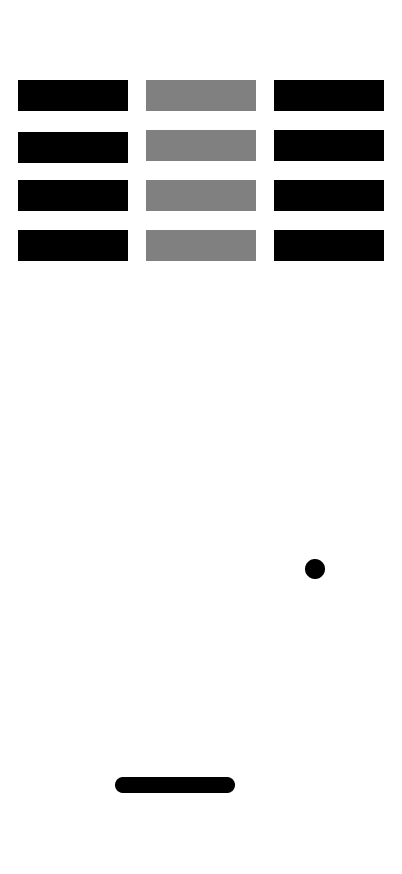

# Wireframes das telas

Este documento descreve as telas representadas pelas imagens disponíveis em
`assets/images`. As imagens representam estados da área principal de jogo do
Brick Breaker, e não telas de menu ou configurações.

## Elementos comuns

Todas as telas possuem a mesma estrutura visual:

- **Área de jogo:** fundo branco, sem moldura visível.
- **Blocos:** retângulos alinhados em linhas. Os blocos pretos e cinzas
	representam os alvos que podem ser atingidos pela bola.
- **Bola:** círculo preto posicionado na área livre abaixo dos blocos.
- **Barra/palheta:** retângulo preto arredondado na parte inferior, usado para
	rebater a bola.

## Tela de jogo 1: formação inicial

### Objetivo

Apresentar o estado inicial de uma fase, antes de o jogador começar a limpar o
tabuleiro.

### Composição

- Quatro linhas de blocos.
- Três colunas visuais, alternando blocos pretos e cinzas.
- A bola aparece na região central inferior do tabuleiro.
- A palheta fica centralizada próxima à borda inferior.

### Comportamento esperado

Ao iniciar a fase, a bola parte dessa região inferior e deve ser rebatida pela
palheta em direção aos blocos. A organização regular dos blocos estabelece o
layout base para a primeira fase.

## Tela de jogo 2: formação reduzida

### Objetivo

Representar um estado intermediário da partida, com o tabuleiro parcialmente
limpo.

### Composição

- Três linhas de blocos.
- Seis colunas visuais, com alternância horizontal entre blocos pretos e
	cinzas.
- A bola está abaixo do conjunto de blocos, ligeiramente à direita do centro.
- A palheta permanece centralizada na parte inferior.

### Comportamento esperado

Os blocos devem desaparecer à medida que forem atingidos. A posição da bola
indica que a partida continua ativa, e a palheta deve continuar respondendo ao
controle do jogador sem mudar sua posição estrutural na tela.

## Tela de jogo 3: formação em degraus

### Objetivo

Apresentar uma formação mais concentrada e desafiadora, adequada para uma fase
posterior ou para um novo padrão de tabuleiro.

### Composição

- Primeira linha com cinco blocos pretos.
- Segunda linha com quatro blocos cinzas, deslocada para a direita.
- Terceira linha com três blocos pretos, novamente deslocada para a direita.
- Quarta linha com dois blocos cinzas, formando o estreitamento central.
- A bola fica abaixo e próxima ao centro da formação.
- A palheta continua centralizada na parte inferior.

### Comportamento esperado

A formação em degraus cria diferentes ângulos de colisão e exige que o jogador
reposicione a palheta com atenção. A progressão deve preservar o movimento da
bola e a remoção dos blocos atingidos, até que o tabuleiro seja concluído ou a
bola deixe a área de jogo.

## Regras de adaptação

Para implementar as telas mantendo o wireframe:

- preservar a área livre entre os blocos e a palheta;
- manter a palheta horizontal e centralizada no estado inicial;
- manter contraste suficiente entre blocos, bola e fundo;
- usar a mesma escala e o mesmo estilo de formas em todas as fases;
- tratar cada imagem como uma configuração de blocos, e não como uma tela
	independente com lógica própria.
