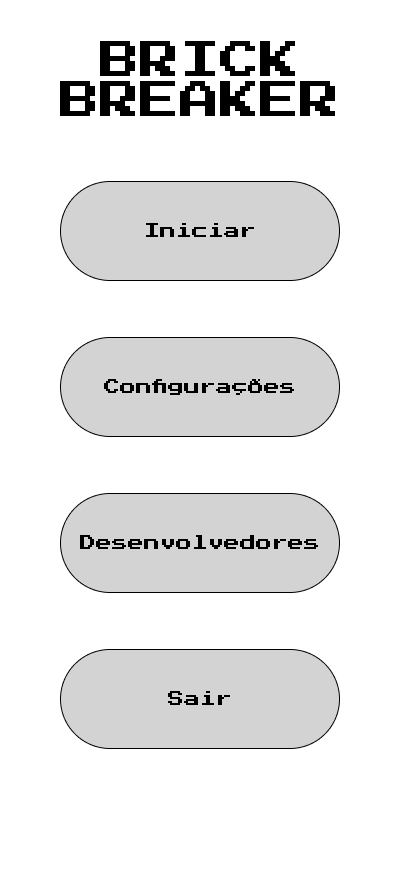
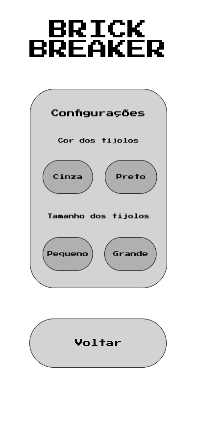
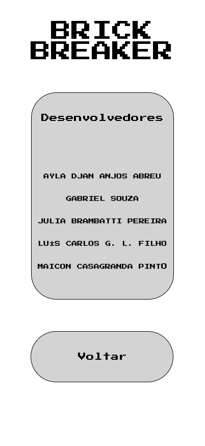
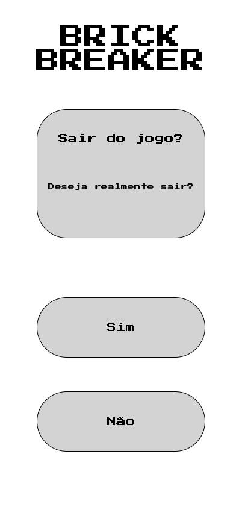
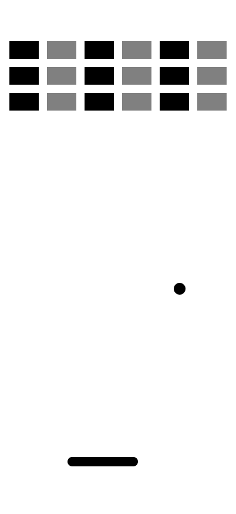
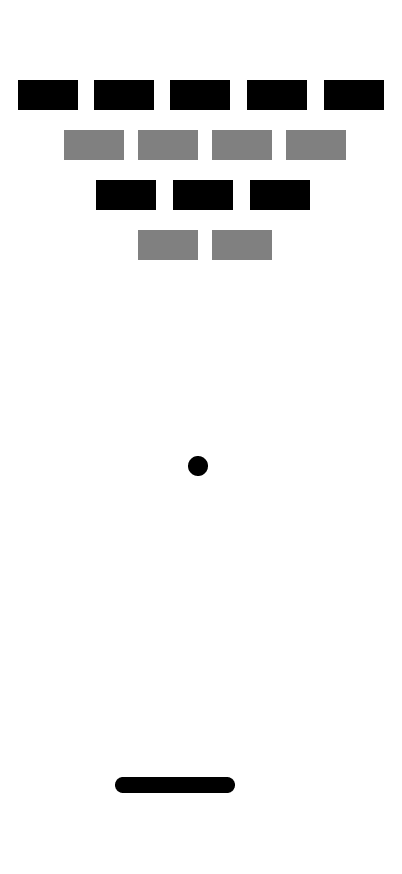
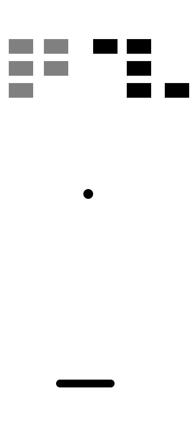
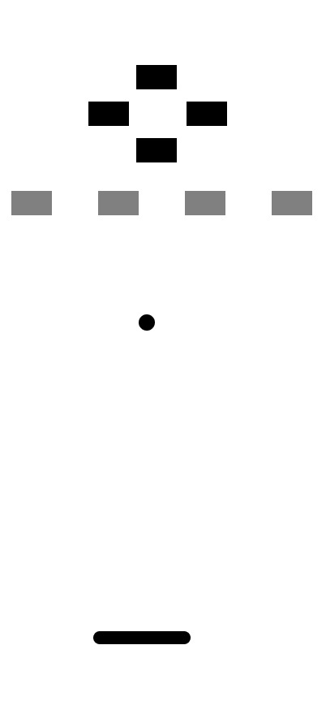

# Wireframes das Telas
## 1. Introdução

Este documento apresenta os wireframes das telas do aplicativo **Brick Breaker**. Os wireframes foram elaborados para definir a organização visual da aplicação e o fluxo de navegação entre as funcionalidades disponíveis.
As imagens utilizadas nesta documentação estão armazenadas na pasta [`wireframes/`](../wireframes/). Cada imagem representa uma tela ou um diálogo previsto para o aplicativo.

## 2. Organização da navegação
A tela inicial funciona como ponto de entrada para as demais funcionalidades. A partir dela, o jogador pode iniciar o jogo, consultar os desenvolvedores, alterar as configurações ou sair da aplicação.

O fluxo principal pode ser representado da seguinte maneira:
```text
                    Tela Inicial
                         |
          +--------------+--------------+-------------------+
          |              |              |                   |
          v              v              v					v
     Integrantes      Iniciar       Configurações		Tela Saída
                         |              |					|
                         v              v					v
                      Nível 1       Ajustes				Sim ou não?  -> Retorna para Tela Inicial
                         |								 |      
                         v								 v
                      Nível 2					  Encerra o jogo
                         |
                         v
                      Nível 3
                         |
                         v
                      Nível 4
                         |
                         v
                      Nível 5
```
## 3. Tela inicial

A tela inicial apresenta o menu principal do jogo e concentra as opções de navegação. Ela deve disponibilizar os seguintes botões:
| Botão | Função |
| ----- | ------ |
| Iniciar | Inicia uma partida do Brick Breaker. |
| Configurações | Abre a tela de configurações visuais do jogo. |
| Desenvolvedores | Exibe os integrantes responsáveis pelo projeto. |
| Sair | Abre a confirmação para encerrar o jogo. |


_Imagem: `wireframes/tela-inicial.png`._


## 4. Tela de configurações

A tela de configurações permite alterar características visuais dos blocos antes ou durante o uso do jogo. Estão previstas as seguintes opções:
- cor dos blocos: cinza ou preto;
- tamanho dos tijolos: pequeno ou grande.

As escolhas realizadas pelo jogador devem ser consideradas na montagem da parede de blocos. O botão de voltar retorna à tela inicial.



_Imagem: `wireframes/tela-configuracoes.png`._
## 5. Tela de desenvolvedores

A tela de desenvolvedores apresenta o nome completo dos integrantes responsáveis pelo desenvolvimento do projeto. Essa tela possui um botão de voltar, que direciona o usuário novamente para a tela inicial.



_Imagem: `wireframes/tela-desenvolvedores.png`._
## 6. Confirmação para sair do jogo

Ao selecionar a opção **Sair** na tela inicial, o aplicativo exibe uma tela ou diálogo de confirmação. O jogador pode escolher uma das alternativas:
| Opção | Comportamento |
| ----- | ------------- |
| Sim | Encerra o jogo. |
| Não | Cancela a ação e retorna à tela inicial. |



_Imagem: `wireframes/tela-sair-jogo.png`._
## 7. Níveis do jogo

Os níveis representam a estrutura da parede que deve ser destruída ao longo da partida. Cada fase mantém a mesma base visual do jogo, com a bola na parte central e a raquete na base da tela, porém a formação dos blocos muda para aumentar ou reduzir o desafio.

### Nível 1

O primeiro nível possui uma parede mais simples e uniforme, com blocos organizados de forma regular para introduzir o sistema de colisão e a dinâmica do jogo.


_Imagem: `wireframes/nivel-01.png`._

### Nível 2

No segundo nível, a parede passa a apresentar pequenos espaços vazios entre os blocos, gerando uma disposição mais irregular e exigindo maior precisão na trajetória da bola.



_Imagem: `wireframes/nivel-02.png`._

### Nível 3

O terceiro nível apresenta uma estrutura mais complexa, com blocos distribuídos de maneira menos previsível. Essa configuração oferece maior dificuldade e exige uma estratégia mais cuidadosa para destruir a parede.



_Imagem: `wireframes/nivel-03.png`._

### Nível 4

O quarto nível apresenta duas formações distintas de blocos, com os blocos cinzas concentrados à esquerda e os blocos pretos distribuídos à direita. Essa organização cria diferentes áreas de contato para a bola, exigindo atenção para controlar sua trajetória e alcançar todos os blocos.



_Imagem: `wireframes/nivel-03.png`._

### Nível 5

O quinto nível apresenta uma estrutura mais organizada, com os blocos pretos formando uma cruz na região superior e os blocos cinzas distribuídos em uma linha horizontal abaixo. Essa configuração cria uma barreira central e exige maior controle da trajetória da bola para atingir os diferentes grupos de blocos.



_Imagem: `wireframes/nivel-05.png`._
